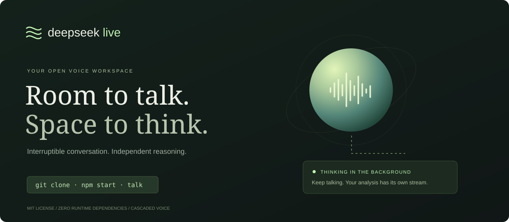

<div align="center">

# DeepSeek Live

**Room to talk. Space to think.**

An open-source voice workspace with interruptible replies and independent background reasoning, powered by DeepSeek.

[한국어](README.ko.md) · [Quick start](#try-it-in-30-seconds) · [Research](docs/RESEARCH.ko.md) · [Architecture](docs/ARCHITECTURE.md) · [Contributing](CONTRIBUTING.md)


</div>



> An independent, early-stage project. This is a **cascaded speech → text → DeepSeek → speech application**, inspired by GPT-Live’s separation of conversation and deeper work. It is **not** a native full-duplex speech model, an official DeepSeek product, or a reproduction of OpenAI’s model.

## Why try it?

- **Keep the conversation going.** Run up to two deeper analyses while chatting on a separate stream.
- **Interrupt a reply.** Stop queued speech and cancel its inference request; background analyses keep running.
- **Listen in English or Korean.** Browser speech recognition and system voices, with a text fallback.
- **See what is happening.** Streaming transcripts, analysis cards, cancellation, and server-measured first-text-token timing.
- **Start without an account.** A clearly labeled, scripted demo exercises the same UI and streaming path without API calls.
- **Own the small codebase.** Node’s built-in HTTP server and vanilla JavaScript. No runtime packages, build step, trackers, or CDN scripts.

## Try it in 30 seconds

Requires **Node.js 22+** (22 or 24 LTS recommended).

```bash
git clone https://github.com/hangi7890/deepseek-live.git
cd deepseek-live
npm start
```

Open **http://127.0.0.1:3000**. No `npm install` is needed.

Without an API key, replies are **scripted demonstration text**, regardless of your question. No claims about AI performance can be inferred from demo timing.

### Connect DeepSeek

```bash
cp .env.example .env
# Edit .env and set DEEPSEEK_API_KEY, then:
npm start
```

The default is `deepseek-flash`, following [DeepSeek’s model documentation](https://api-docs.deepseek.com/quick_start/pricing/), checked September 16, 2026. Normal conversation explicitly disables thinking; background analysis enables it. Model names and availability can change: override `DEEPSEEK_MODEL` and `DEEPSEEK_REASONING_MODEL` as needed. Usage is billed by your provider.

**Never paste your DeepSeek API key into the UI.** The Settings token is an optional workspace password for shared hosting, not a provider key.

### A one-minute walkthrough

1. Select **Explore the architecture** to start a background analysis.
2. Type a new question while its card is still streaming.
3. Press **Interrupt** or **Escape**. The foreground reply stops; the analysis continues.
4. Select **Discuss result** to place a completed analysis into the composer for your next message.
5. In Chrome, allow the microphone with **Start listening**. Use headphones to avoid recognizing the assistant’s speaker output.
6. Choose **한국어** in Settings for Korean recognition and responses.

`Enter` sends, `Shift+Enter` inserts a newline. **New session** clears local conversation and cancels all requests. Closing the tab also cancels its work: background jobs are not durable workers.

## What it does — and does not do

| Capability | v0.1 |
|---|---|
| DeepSeek text streaming + sentence-level browser speech | Implemented |
| User-selected background reasoning | Implemented; independent request per analysis |
| Interrupt foreground without cancelling analysis | Implemented |
| Concurrent microphone recognition and playback | Browser-dependent; use headphones |
| Native audio understanding / learned turn-taking | Not implemented |
| Automatic model-initiated task delegation | Not implemented; use Deep think |
| Web search, computer control, external tool execution | Not implemented |
| Local/offline speech recognition guarantee | Not provided; browser services may be remote |
| WebRTC media server, WARP, GPU inference migration | Not implemented |
| Production multi-user accounts and durable jobs | Not implemented |

DeepSeek receives text transcripts; emotion, prosody, and other acoustic cues are not passed to it. The app waits for final browser transcripts plus a short pause. A real native full-duplex model requires a different audio inference layer and training, not just another API endpoint. See the [source-based research and roadmap](docs/RESEARCH.ko.md).

## Configuration

| Variable | Default | Purpose |
|---|---|---|
| `DEEPSEEK_API_KEY` | empty | Empty enables scripted demo |
| `DEEPSEEK_BASE_URL` | `https://api.deepseek.com` | Provider base, optionally including `/v1`; `/chat/completions` is appended |
| `DEEPSEEK_MODEL` | `deepseek-flash` | Conversation model |
| `DEEPSEEK_REASONING_MODEL` | same as conversation | Background model |
| `HOST` | `127.0.0.1` | Bind address |
| `PORT` | `3000` | HTTP port |
| `LIVE_ACCESS_TOKEN` | empty | Required, at least 24 characters, for non-loopback binding |
| `PUBLIC_ORIGIN` | empty | Exact external HTTPS origin for reverse proxies |

Other endpoints must support DeepSeek’s `thinking` parameter and Chat Completions SSE format. Generic OpenAI-compatible endpoints are **not automatically compatible**.

## Self-hosting

This repository contains an application server; GitHub Pages alone cannot run it. For a private Docker instance:

```bash
docker build -t deepseek-live .
# .env must include a strong LIVE_ACCESS_TOKEN (24+ characters).
docker run --rm --env-file .env -e HOST=0.0.0.0 -p 127.0.0.1:3000:3000 deepseek-live
```

For remote access, put it behind a TLS reverse proxy, disable response buffering, and set `PUBLIC_ORIGIN=https://your-domain.example`. Keep the shared workspace token private. Server-wide limits are six simultaneous requests and 30 starts per minute, with 60-second conversation / 180-second analysis timeouts. This is a small shared workspace, not a public SaaS service.

The server does not persist transcripts or log request content. Browser speech services and DeepSeek may process data under their own policies. Conversation state is in tab memory; refresh clears it. See [security and privacy](SECURITY.md).

## Development and verification

```bash
npm run dev
npm run check
npm test
```

Tests cover fragmented UTF-8 SSE, incomplete responses, secret isolation, input validation, provider contract, independent cancellation, auth/origin/Host restrictions, and concurrent request limits. [Validation details and manual checks](docs/VALIDATION.md) distinguish simulated tests from actual provider and microphone testing. First text token timing is **not** end-to-end voice latency. No GPT-Live performance parity claim is made.

## Help make it better

Useful contributions: streaming speech provider adapters, voice regression fixtures, accessibility, additional languages, and a truly full-duplex audio backend. Start with [CONTRIBUTING.md](CONTRIBUTING.md). If this project is useful to you, a star helps others find it.

MIT licensed. DeepSeek and OpenAI names belong to their respective owners. No affiliation or endorsement is implied.
