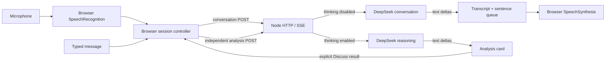

# Architecture

This is a small application, not a new trained speech model. Node.js handles validated text requests; the browser owns transient session state and speech.

## Cancellation semantics

Every foreground request has its own AbortController and generation number. On interruption, the browser invalidates the generation, aborts its HTTP request, clears pending speech, and calls `speechSynthesis.cancel()`. Late events from old requests cannot mutate the current reply. Socket closure aborts the upstream provider request. Already-generated provider tokens can still be billed.

Each analysis has a separate AbortController, so interrupting speech does not cancel it. Cancel analysis affects one job. New session and page exit cancel everything. Analyses last only while the tab remains connected; there is no durable worker queue. Completed answers enter a subsequent conversation only after the user chooses Discuss result and sends the message.

The browser waits for final ASR text and a 650ms pause. Partial transcripts can interrupt current output but are not submitted as finalized user messages. This is heuristic endpointing, not learned full-duplex turn-taking. Browser echo cancellation varies; headphones are recommended. Speech is emitted in sentence chunks. The sentence splitter is intentionally simple, so abbreviations and decimals can sound imperfect.

## Stream protocol

`POST /api/respond` accepts `{messages, language: "en" | "ko", deep: boolean}`. Messages allow user/assistant roles only. The server inserts its own system prompt. Authentication, when enabled, is `Authorization: Bearer <workspace token>`.

| Event | Meaning |
|---|---|
| `meta` | Model and explicit demo flag |
| `status` | Reasoning has begun; private reasoning text is never forwarded |
| `timing` | Milliseconds from provider call start to first answer text |
| `token` | Incremental `{text}` |
| `done` | Final timing; successful completion |
| `error` | Sanitized failure; no success marker follows |

Comments provide a 10-second heartbeat. The shared parser handles fragmented UTF-8 and CRLF. Upstream completion requires `[DONE]`; truncated streams fail visibly. Backpressure is observed when writing content frames. Provider calls have deadlines and finite output budgets.

## Boundaries

- Server: fixed static allowlist, no filesystem browsing, no transcript persistence, no key in client config.
- Request controls: 200 KB body, 40 messages, 8,000 characters per message, 48,000 total characters; six active requests, 30 starts/minute per process.
- Browser: recent context trimmed to roughly 40,000 characters, up to two active analyses and eight retained cards. Transcript display is separate from model history.
- Auth: optional shared token for loopback, required 24+ characters for non-loopback CLI startup. Public origin and Host checks protect the local service from cross-site requests and DNS rebinding.
- Deployment: one process; no per-user quota or multi-tenant isolation. Do not treat the shared token as enterprise authentication.

## Extension points

`lib/provider.mjs` is the text-provider boundary. `completion()` is an async iterator over token or thinking-status events. Tests inject a provider or fetch implementation without network charges. A different provider must honor or translate DeepSeek’s `thinking` extension.

Speech capture and playback currently live in `public/app.js`. A future native audio engine should expose media sessions and interruption events separately from the text provider; it cannot be implemented merely by changing `DEEPSEEK_BASE_URL`.
