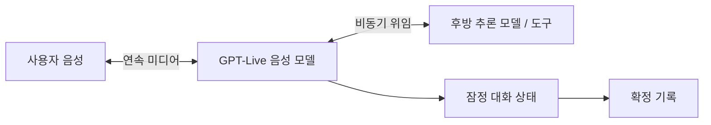

# GPT-Live 기술 조사와 DeepSeek Live 설계

조사일: **2026-09-16**. 공개 자료를 검색·열람한 결과이며 비공개 모델 구조를 역공학한 보고서가 아닙니다. 공식 발표, 엔지니어 인터뷰, 관련 논문, 직접 측정 기사에 근거 수준을 표시합니다.

## 1. 확인한 구조

GPT-Live의 핵심은 **지속적인 음성 상호작용과 깊은 추론의 분리**입니다. 입력과 출력을 같은 음성 모델이 동시에 처리하고, 추가 작업은 다른 모델에 위임합니다. 출시 때 설명한 후방 모델과 이후 API 문서의 모델 선택지는 시점이 다르므로 고정된 하나의 모델 조합으로 이해하면 안 됩니다. [공식 출시 자료, 2026-07-08](https://openai.com/index/introducing-gpt-live/) · [공식 API 출시 자료, 2026-09-10](https://openai.com/index/introducing-gpt-live-1-in-the-api/)

공식 엔지니어링 문서가 공개한 시스템 요소는 다음과 같습니다.

- 음성 미디어와 추론 루프를 지연에 민감한 경로로 유지하고, 도구·저장·위임은 비동기 RPC 경계 밖으로 분리합니다.
- Go 기반 미디어 처리와 WebRTC를 사용합니다.
- 상태를 가진 추론 세션을 유지하고, 새 인스턴스를 예열하여 컨텍스트 축약·이동 시 전환합니다.
- 위임 모델의 컨텍스트 준비와 캐시를 활용합니다.
- 실시간 화면용 잠정 대화 상태와 확정된 기록을 구분합니다.
- WARP와 Instant Connect는 연결 초기 지연을 줄이는 별도 전송 계층 개선입니다.

이 항목은 **시스템 설계**에 대한 공개 정보입니다. 음성 토크나이저, 모델 층 수, 파라미터 수, 학습 손실, 데이터 조합까지 설명하는 완전한 재현 명세는 아닙니다. [OpenAI 엔지니어링 원문, Justin Uberti·Zahan Malkani, 2026-08-03](https://openai.com/index/continuous-voice-interaction-with-gpt-live/)

도식은 공개 설명을 압축한 개념도이며 실제 서버 토폴로지나 모델 계산 그래프를 의미하지 않습니다.

## 2. 인터뷰와 기사

**인터뷰 / 1차 발언:** InfoQ의 Eran Stiller가 Justin Uberti에게 경계 설계, 상태 관리, 전송 선택, 운영 테스트를 질문했습니다. Uberti는 WebRTC를 통째로 대체하기보다 핸드셰이크를 점진적으로 개선한 판단, 실제 입력을 처리하되 출력은 폐기한 사전 테스트를 설명합니다. 구현 시 얻을 교훈은 기능이 많은 서버보다 오디오 경로의 예측 가능한 지연을 먼저 확보하는 것입니다. 마지막 문장은 이 프로젝트의 설계 해석입니다. [InfoQ 원문, 2026-09-02](https://www.infoq.com/news/2026/09/openai-gpt-live/)

**실측 기사 / 측정 주체의 1차 자료:** Agora Media Lab은 실제 장치와 네트워크 조건을 통제해 대화 전환, 중단, 잡음, 패킷 손실을 평가했습니다. 자연스러움은 하나의 지연 수치로 대표할 수 없다는 점을 프로젝트 검증 항목에 반영했습니다. Agora는 음성 인프라 공급자이므로 자체 측정 결과를 보편적 성능 수치로 일반화하지 않습니다. [Agora, Hermes Frangoudis, 2026-07-10](https://www.agora.io/en/blog/openai-didnt-publish-gpt-lives-latency-so-we-measured-it/)

**출시 보도:** TechCrunch의 현장 브리핑 기사도 확인했습니다. 기술 구조 판단은 공식 문서와 엔지니어 인터뷰를 우선했습니다. [Ivan Mehta, 2026-07-08](https://techcrunch.com/2026/07/08/openai-releases-new-voice-models-for-more-natural-live-conversations/)

## 3. 논문: 공개 full-duplex 모델에서 배울 점

**Moshi: a speech-text foundation model for real-time dialogue**는 사용자와 시스템 음성을 병렬 스트림으로 모델링하고, 신경 오디오 코덱 토큰과 텍스트를 함께 생성합니다. 텍스트가 음성 토큰보다 먼저 정렬되어 나오는 설계를 설명합니다. 전통적인 STT → LLM → TTS와 모델 수준에서 다릅니다. 이 논문은 공개 full-duplex 구현의 참고 자료이지 **GPT-Live가 Moshi를 사용한다는 증거가 아닙니다.** [Défossez et al., arXiv:2410.00037](https://arxiv.org/abs/2410.00037) · [저자들의 구현](https://github.com/kyutai-labs/moshi)

검색·열람한 자료 범위에서 GPT-Live의 가중치와 학습 절차를 그대로 재현할 수 있는 논문은 확보하지 못했습니다. 그러므로 논문에서 확인한 일반 원리와 GPT-Live의 실제 구현을 구분합니다. 네이티브 full-duplex를 재현하려면 오디오 모델, 스트리밍 코덱, 학습 데이터, 평가, GPU 운영이 추가로 필요합니다.

## 4. DeepSeek 연결

조사일의 공식 모델 표는 `deepseek-flash`를 안내합니다. 오래된 검색 결과에는 `deepseek-chat`, `deepseek-reasoner`, `deepseek-v4-flash`가 남아 있어 현재 표를 우선했습니다. 모델은 환경변수로 교체할 수 있습니다. [현재 모델 표](https://api-docs.deepseek.com/quick_start/pricing/)

Chat Completions 요청에서 `thinking.type`을 `disabled` 또는 `enabled`로 명시하고, `stream: true`로 응답을 받습니다. 추론 전용 델타는 사용자에게 읽어 주지 않고 작업 중 상태로만 표시합니다. [Thinking Mode 공식 문서](https://api-docs.deepseek.com/guides/thinking_mode/)

현재 앱은 DeepSeek의 **텍스트 입력·출력 경로**를 사용합니다. DeepSeek 전체 제품의 지원 모달리티에 대한 주장이 아닙니다. 앱의 실제 계약은 텍스트 메시지와 SSE이며 오디오 데이터는 DeepSeek 요청에 넣지 않습니다.

## 5. 이번 구현과 원본의 차이

| 요소 | 공개 GPT-Live 설명 | DeepSeek Live v0.1 |
|---|---|---|
| 음성 이해·출력 | 네이티브 연속 음성 모델 | 브라우저 STT + DeepSeek 텍스트 + 브라우저 TTS |
| 발화 결정 | 모델이 지속적으로 결정 | 브라우저 최종 인식 결과 + 650ms 지연 |
| 끼어들기 | 음성 모델의 상호작용 동작 | 인식 텍스트 발생 시 현재 요청·재생 취소 |
| 깊은 작업 | 모델이 비동기로 위임 | 사용자가 Deep think를 선택, 독립 요청 실행 |
| 대화 상태 | 상태를 가진 추론과 컨텍스트 이동 | 브라우저 메모리의 제한된 최근 메시지 |
| 미디어 전송 | WebRTC 기반 | 브라우저 음성 서비스; 앱 서버에는 텍스트 SSE |
| 오래된 출력 | 연속 상호작용 시스템 | 요청 세대 번호와 AbortController로 폐기 |
| 측정 | 복수 대화·작업·지연 평가 | 서버 첫 텍스트 토큰/전체 시간, 취소·계약 테스트 |

**설계 판단:** 작은 공개 앱에서 우선 재현 가능한 부분은 대화와 분석의 독립성, 취소 경계, 명료한 상태 표시입니다. 네이티브 오디오 모델로 가장하면 기여자에게 잘못된 목표를 전달하므로 이 차이를 README와 화면에 표시합니다.

## 6. 발전 순서

1. 실제 DeepSeek API와 한국어·영어 장치별 음성 E2E 측정. TTFT와 첫 가청 응답 지연을 분리합니다.
2. 브라우저 의존성을 줄이는 스트리밍 STT/TTS 어댑터, AEC/VAD 및 음성 중단 회귀 테스트.
3. 공개 full-duplex 음성 모델을 별도 미디어 서비스로 붙이는 실험. 라이선스, 하드웨어, 언어 지원부터 검토합니다.
4. 후방 DeepSeek 작업을 음성 모델이 실제로 위임하고, 변경된 대화 문맥에 맞춰 결과를 재통합합니다.
5. 영속 작업 큐, 사용자 인증, 분산 제한, 세션 복구, 음성 평가 데이터셋을 추가합니다.

이 목록은 **아직 구현되지 않은 로드맵**입니다. Star 수, 성능 우위, 비용 절감률은 검증 없이 약속하지 않습니다.
